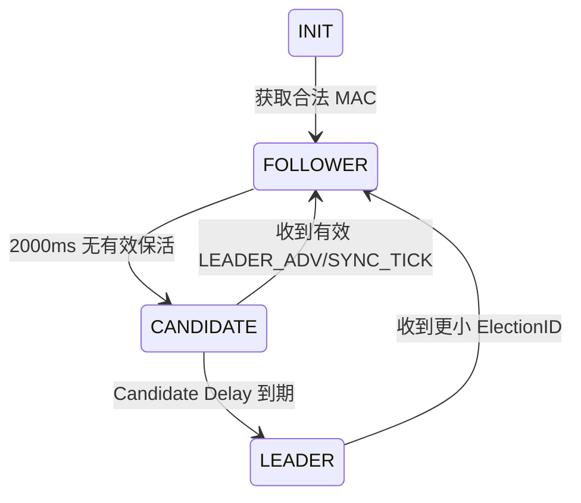

# PRD：UART1 接入 Beacon Mesh 蓝牙模组

> 状态：已实现首版，待硬件联调
>
> 固件仓库：`PY32F0xx_Firmware_V1.5.0`
>
> PC 参考实现：`/Users/chenqiuyu/Coding/定制协议/beacon-mesh/serial-simulator`

## 1. 目标与范围

通过 UART1 完成 MCU 与 Beacon Mesh 蓝牙模组的基础通信闭环，并通过 UART2 输出可追踪的工作状态。

本期实现：

- 模组启动通知、MAC 查询与 `ElectionID` 获取。
- 固定 `NetworkID=0x1234`。
- 无 Relay 转发的 Leader 竞选、保活、接班和双 Leader 收敛。
- 遥控器 `0x91` 广播协议解析及可读名称日志。
- Leader Beacon 通过 `0x92` 发送。
- UART2 输出状态机、关键帧和异常日志。
- 板载 LED 按上电展示和 Mesh 角色显示工作。

本期不实现：

- `Cmd=0xFF` 配网写入和 NetworkID 持久化。
- MCU 对收到广播的 Relay 转发、退避和转发去重。
- APP/遥控器控制命令的实际灯效执行。
- UART2 调试命令通道。
- 动态 100ms 同步频率。

## 2. 协议依据

- UART 帧协议：`doc/alpha-stake-light/Beacon Mesh 模组十六进制串口协议.md`
- Beacon 状态机：`doc/alpha-stake-light/插地灯 Beacon Mesh 组网与角色状态机说明.md`
- 遥控器协议：`doc/alpha-stake-light/广云标准遥控器广播协议.md`
- PC 协议编码：`serial-simulator/src/protocols/uartFrame.ts`、`beacon.ts`、`remote.ts`
- PC 状态机：`serial-simulator/src-tauri/src/runtime.rs`

本实现采用 PC 模拟器的 25B Beacon 业务区格式。协议资料中关于 `0x92` 自动补齐 7B 固定头的描述与 31B 空口长度存在矛盾，本期 MCU 与模组 UART 之间只交换完整 25B Beacon 业务区。

## 3. UART1 通信

UART1 硬件保持现有配置：

- PA2/TX、PA3/RX、AF1。
- 115200 bps、8N1、无硬件流控。
- DMA + IDLE 负责接收和切帧。
- 中断只缓存帧；协议解析、发送和日志均在主循环执行。

UART 帧格式：

```text
模组 -> MCU：AA 55 CMD LEN_H LEN_L PAYLOAD CHECK FE
MCU -> 模组：55 AA CMD LEN_H LEN_L PAYLOAD CHECK FE
```

校验为从帧头开始到 Payload 末尾的 8 位累加和。当前支持：

| 指令 | 方向 | 作用 |
| --- | --- | --- |
| `0x20` | 模组 -> MCU | 模组启动完成 |
| `0x71` | 双向 | MCU 查询、模组回复 MAC |
| `0x91` | 模组 -> MCU | 上报遥控器或 Beacon 广播 |
| `0x92` | MCU -> 模组 | 下发 Beacon 业务区 |

收到合法 `0x20` 后，MCU 发送：

```text
55 AA 71 00 00 70 FE
```

只有收到合法且非全零的 6B MAC 后，MCU 才允许参与选举和发送 Beacon。

### 上电握手恢复

`0x20` 可能早于 MCU UART1 初始化发送且只发送一次，因此 MCU 不依赖该通知才能完成握手。UART1 初始化后，MCU 在未获得 MAC 时每 500ms 主动发送一次：

```text
55 AA 71 00 00 70 FE
```

收到合法 `0x20` 时立即查询 MAC，但与主动查询共享 500ms 节流。收到合法、非全零 6B MAC 后，MCU 将 `module_ready` 和 `mac_ready` 同时置位，停止 `0x71` 重试，并进入 `FOLLOWER`。因此模组先上电、MCU 后复位时无需重新给模组断电。

若未连接模组，MCU 只保留 500ms 查询重试，不参与选举、不发送 Beacon；启动 LED 展示结束后保持熄灭。

## 4. 固定网络身份

```text
NetworkID = 0x1234
```

写入 Beacon 业务区时使用大端序：

```text
Byte0 = 0x12
Byte1 = 0x34
```

收到遥控器 `Cmd=0xFF` 时只解析和打印日志，不改变 NetworkID，不写 Flash。

## 5. Mesh 状态机



状态：`INIT`、`FOLLOWER`、`CANDIDATE`、`LEADER`。

Candidate Delay：

```text
100ms + (ElectionID[5] % 100)ms
```

固件的 `wos` 以 400us 为一个 tick，因此内部使用 2500 tick=1000ms、5000 tick=2000ms 等等效时长。

规则：

- `INIT -> FOLLOWER`：成功获得 MAC。
- `FOLLOWER -> CANDIDATE`：连续 2000ms 未收到同 NetworkID 的有效 `LEADER_ADV` 或 `SYNC_TICK`。
- `CANDIDATE -> FOLLOWER`：Candidate Delay 期间收到有效 Leader 广播。
- `CANDIDATE -> LEADER`：Candidate Delay 到期仍未收到有效 Leader。
- 成为 Leader 后立即发送首个 `LEADER_ADV`。
- 已成立 Leader 收到更小完整 6B `ElectionID` 后降级为 Follower。
- Leader 运行期间，新上线的更小 ElectionID 节点不会主动抢占现有 Leader。
- Leader 收到更大 ElectionID 时保持 Leader，并记录 `MULTIPLE_LEADER_DETECTED`。

默认发送节奏：

- `LEADER_ADV`：1000ms。
- `SYNC_TICK`：200ms。
- `SEQ`：从 1 开始递增，溢出后回到 1。
- UART1 Beacon 发送间隔不小于 200ms。

### LED 状态展示

板载 LED 为 PB5，低电平点亮。LED 展示由 Mesh 状态机在主循环统一调度，优先级如下：

1. 上电后 3 秒内，每 500ms 亮灭翻转一次；该展示优先于角色显示。
2. 上电展示结束后，`LEADER` 状态常亮。
3. `FOLLOWER` 状态平时灭灯；收到合法且非本机的 `LEADER_ADV` 或 `SYNC_TICK` 后亮 100ms，再自动熄灭。
4. `INIT`、`CANDIDATE`、未收到模组指令或未获得合法 MAC 时灭灯。

合法心跳必须通过 UART 和 Beacon 校验、NetworkID、命令及 ElectionID 检查。错误帧、其他网络、本机回环和遥控器广播不会触发心跳闪灯。进入 Leader 时取消心跳计时并立即常亮；离开 Leader 时立即按新角色刷新 LED。旧的 `USER_LED_TEST` 1ms 启动翻转和 `Task_500ms()` 无条件翻转已关闭。

Beacon 的 `Payload[0..5]` 为来源 ElectionID；`LEADER_ADV` 的 `Payload[6]=1` 表示 Leader 正常运行，`Payload[7]=200` 表示同步周期。

## 6. Beacon 接收与发送

有效 Beacon 必须同时满足：

- UART 帧校验正确。
- Payload 长度为 25B。
- BeaconChecksum 正确。
- NetworkID 等于 `0x1234`。
- Cmd 为 `0x80` 或 `0x81`。
- Payload 前 6B 为非全零合法 ElectionID。
- 来源不是本机。

发送的 25B 业务区布局：

```text
NetworkID(2B) + SEQ(1B) + Cmd(1B) + Flags(1B)
+ Payload(19B) + BeaconChecksum(1B)
```

本期无 Relay：

- 不转发任何 `0x91` 收到的广播。
- MCU 发送 Beacon 的 `Flags=0x00`。
- `Relayed` bit 始终为 0。
- BeaconChecksum 在最终发送前重新计算。

## 7. 遥控器解析

`0x91` 且 Payload 长度为 16B 时按标准遥控器协议解析：

| Offset | 字段 | 规则 |
| ---: | --- | --- |
| 0~3 | CID | `03 09 4C 5A` |
| 4 | Len | `0x0B` |
| 5 | SigType 高字节 | `0xFF` |
| 6 | SigType 低字节 | `0xCC` 遥控器、`0xDD` APP、`0x99` 测试遥控器 |
| 7 | Version | `0x02` |
| 8 | Count | 原样记录 |
| 9~10 | Address | 大端 16 位地址 |
| 11 | Cmd | 原始命令码 |
| 12 | CmdType | `0x00` 短按、`0x01` 长按、`0x02` 抬起、`0xAA` 测试 |
| 13 | Para | 原样记录 |
| 14 | Rand | 原样记录 |
| 15 | Check | CID~Rand XOR |

合法帧只解析并打印日志，不执行灯控动作。非法 CID、Len、SigType、Version 或 XOR 校验失败的帧直接丢弃。

## 8. UART2 日志

日志使用现有 UART2 PB6 输出，115200 8N1。详细 UART1 原始十六进制日志由 `APP_VERBOSE_UART1_RX` 控制；BLE/Mesh 业务日志由 `APP_BLE_DEBUG_LOG` 控制。

关键输出包括：

- 模组启动、MAC 查询、MAC/ElectionID 获取。
- NetworkID、角色迁移和迁移原因。
- Leader 超时、Candidate Delay、选举成功和 Leader 降级。
- `LEADER_ADV`、`SYNC_TICK` TX/RX 摘要。
- 遥控器来源名、Address、Cmd、CmdType、Para、Rand 和校验结果。
- UART 帧错误、BeaconChecksum 错误、NetworkID 不匹配、无效 ElectionID。
- `Cmd=0xFF` 被忽略的原因。

UART1 中断不调用 `printf()`，不调用阻塞式 `APP_UsartTransmit()`。

示例：

```text
[BLE] Beacon Mesh init NetworkID=0x1234 waiting module ready
[BLE] module ready
[BLE] TX MAC query 0x71
[BLE] MAC/ElectionID=1A 09 E2 49 8F 34
[MESH] INIT -> FOLLOWER reason=MAC_READY
[MESH] FOLLOWER -> CANDIDATE reason=LEADER_TIMEOUT
[MESH] CANDIDATE -> LEADER reason=CANDIDATE_DELAY
[MESH] TX LEADER_ADV seq=1 network=0x1234 flags=0x00
[REMOTE] source=遥控器 addr=0x1115 cmd=0x0A type=短按 para=0x00 rand=0x00 check=OK
```

## 9. 代码入口

主要实现位于：

- `PY32F003xx_Project_LL/User/Src/user_ble_uart.c`：UART 帧校验、0x20/0x71/0x91/0x92 分发、遥控器解析和 Mesh 状态机。
- `PY32F003xx_Project_LL/User/Inc/user_ble_uart.h`：`APP_BleMeshInit()` 与 `APP_HandleBleUartFrame()`。
- `Drivers/BSP/Src/user_bsp_uart1.c`：UART1 DMA+IDLE 接收；中断只锁存帧。
- `PY32F003xx_Project_LL/Src/main.c`：系统初始化后调用 `APP_BleMeshInit()`，主循环调用 `APP_HandleBleUartFrame()`。
- `PY32F003xx_Project_LL/User/Src/user_task.c`：512ms 任务日志受 `APP_TASK_512MS_WOS_LOG` 控制。

核心运行时类型包括 `mesh_role_t`、`beacon_pkt_t`、`remote_pkt_t` 和 `mesh_runtime_t`。

## 10. 验收清单

### 协议与日志

- [ ] UART `0x20` 后能发送 `0x71`。
- [ ] 未收到 `0x20` 时，MCU 每 500ms 主动查询 `0x71`。
- [ ] 仅收到合法 MAC 时也能确认模组就绪并停止查询重试。
- [ ] 合法 MAC 进入 Follower；MAC 缺失或全零不选举。
- [ ] `0x91` 遥控器三种来源和四种 CmdType 能输出可读名称。
- [ ] 遥控器非法 CID/XOR/版本/来源不会进入业务处理。
- [ ] `0xFF` 只打印，不改写 NetworkID。
- [ ] `0x92` 帧为 25B Beacon 业务区，UART 和 Beacon 校验均正确。
- [ ] 所有 MCU Beacon 的 Flags 为 `0x00`。

### 状态机

- [ ] 单节点能在超时和 Candidate Delay 后成为 Leader。
- [ ] 两个同 NetworkID 节点按最小 ElectionID 选主。
- [ ] Leader 每 1000ms 发送 `LEADER_ADV`，每 200ms 发送 `SYNC_TICK`。
- [ ] Leader 掉线后 Follower 在 2000ms 后进入 Candidate。
- [ ] Candidate Delay 期间收到保活后回到 Follower。
- [ ] 双 Leader 互通后较大 ElectionID 降级。
- [ ] 不同 NetworkID 的 Beacon 不影响状态机。
- [ ] 不发生 MCU Relay 转发。

### LED 展示

- [ ] 上电前 3 秒按 500ms 周期亮灭。
- [ ] 未连接模组时上电展示结束后保持灭灯。
- [ ] Leader 状态持续常亮。
- [ ] Follower 平时灭灯，收到有效 Leader 心跳后亮约 100ms。
- [ ] Candidate、错误 Beacon、其他 NetworkID 和本机回环 Beacon 不触发亮灯。
- [ ] Leader 降级后立即熄灭，Follower 下一次有效心跳再闪灯。

### 硬件联调

- [ ] 至少两个真实 MCU+Beacon Mesh 模组完成 UART1 联调。
- [ ] UART2 能记录启动、MAC、角色和 Beacon 状态。
- [ ] 验证 Leader 断电后的接班。
- [ ] 验证不同 NetworkID 隔离。
- [ ] 保存一份 UART2 联调日志作为交付记录。
