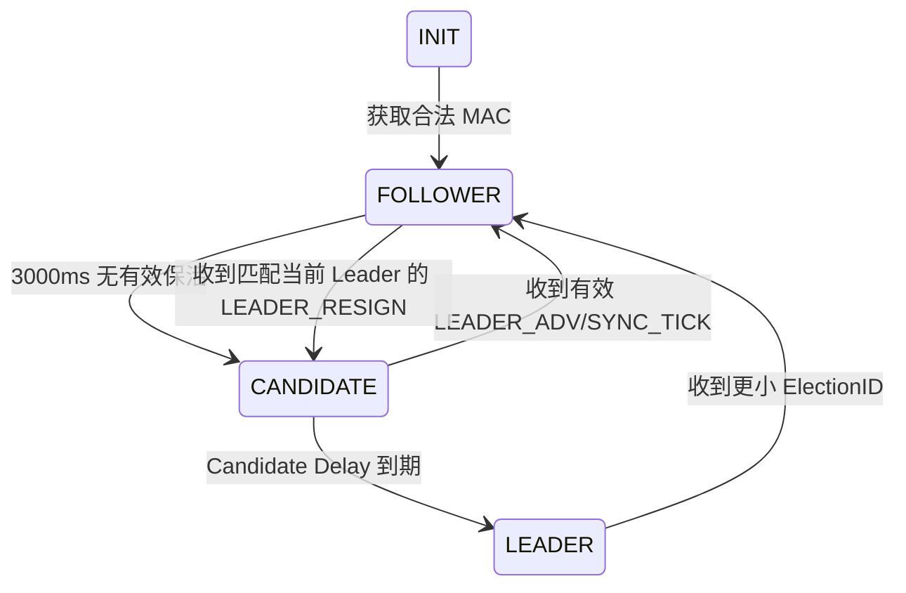

# PRD：UART1 接入 Beacon Mesh 蓝牙模组（第二迭代）

> 状态：设计基线，待固件实现和硬件联调
>
> 固件仓库：`PY32F0xx_Firmware_V1.5.0`
>
> PC 参考实现：`/Users/chenqiuyu/Coding/定制协议/beacon-mesh/serial-simulator`

## 1. 目标与范围

在首版 UART1 接入、Leader 竞选和 Beacon 基础收发的基础上，完成 Beacon Mesh 一跳 Relay 和统一业务发送调度，支持较远节点的 Leader 宣告、灯效同步以及 Follower 遥控器反向转发。

本轮目标拓扑：

```text
Leader A ──> Follower/Relay B ──> Follower C
                         ↑
                   遥控器只能覆盖 B
                         │
                         └── B -- 0x83 --> A
```

本轮实现：

- 模组启动通知、MAC 查询与 `ElectionID` 获取。
- 固定 `NetworkID=0x1234`。
- Leader 竞选、保活、接班和双 Leader 收敛。
- `LEADER_ADV`、`SYNC_TICK`、`LEADER_RESIGN` 的一跳 Beacon Relay。
- Follower 对合法遥控器普通控制封装为 `REMOTE_CONTROL_RELAY (0x83)`，经一跳送达 Leader。
- 统一 `0x92` 发送队列，协调 Leader 周期帧、Relay 帧和 UART 最小发送间隔。
- Beacon/遥控器逻辑去重、Relay 退避和退避取消。
- UART2 输出队列、Relay、去重、状态机和遥控器消费日志。
- Leader 对遥控器控制完成可观测消费并生成最新 `SYNC_TICK`；真实灯效驱动由独立灯效模块完成。
- 板载 LED 按上电展示和 Mesh 角色显示工作。

本轮不实现：

- `Cmd=0xFF` 配网写入和 NetworkID 持久化。
- 多跳路由、路径选择、路由表、转发 ACK 或指定 Relay 节点。
- 未明确声明可转发的 MCU 私有命令。
- OTA、大参数配置包和配置包 Relay。
- 低功耗扫描策略切换；当前扫描配置只作为可靠性基线。
- 真实灯效动作驱动；本轮只要求 Leader 产生统一的控制消费事件和同步帧。
- 新增 UART 指令、新增 Beacon 字段或改变 25B Beacon 业务区格式。

## 2. 协议依据

- UART 帧协议：`doc/alpha-stake-light/Beacon Mesh 模组十六进制串口协议.md`
- Beacon 状态机：`doc/alpha-stake-light/插地灯 Beacon Mesh 组网与角色状态机说明.md`
- 遥控器协议：`doc/alpha-stake-light/广云标准遥控器广播协议.md`
- 全局时序：`/Users/chenqiuyu/Coding/定制协议/beacon-mesh/design/global-timing.md`
- Relay 机制：`/Users/chenqiuyu/Coding/定制协议/beacon-mesh/protocol/relay.md`
- Beacon 广播定义：`/Users/chenqiuyu/Coding/定制协议/beacon-mesh/protocol/beacon-broadcast.md`
- PC 协议编码：`serial-simulator/src/protocols/uartFrame.ts`、`beacon.ts`、`remote.ts`
- PC 状态机：`serial-simulator/src-tauri/src/runtime.rs`

本实现采用 PC 模拟器的 25B Beacon 业务区格式。协议资料中关于 `0x92` 自动补齐 7B 固定头的描述与 31B 空口长度存在历史差异，本轮 MCU 与模组 UART 之间仍只交换完整 25B Beacon 业务区，不修改该接口。

## 3. UART1 通信

UART1 硬件保持现有配置：

- PA2/TX、PA3/RX、AF1。
- 115200 bps、8N1、无硬件流控。
- DMA + IDLE 负责接收和切帧。
- 中断只缓存帧；协议解析、发送和日志均在主循环执行。

UART 帧格式：

```text
模组 -> MCU：AA 55 CMD LEN_H LEN_L PAYLOAD CHECK FE
MCU -> 模组：55 AA CMD LEN_H LEN_L PAYLOAD CHECK FE
```

校验为从帧头开始到 Payload 末尾的 8 位累加和。继续使用现有指令：

| 指令 | 方向 | 作用 |
| --- | --- | --- |
| `0x20` | 模组 -> MCU | 模组启动完成 |
| `0x71` | 双向 | MCU 查询、模组回复 MAC |
| `0x91` | 模组 -> MCU | 上报遥控器或 Beacon 广播 |
| `0x92` | MCU -> 模组 | 下发完整 25B Beacon 业务区 |

收到合法 `0x20` 后，MCU 发送：

```text
55 AA 71 00 00 70 FE
```

只有收到合法且非全零的 6B MAC 后，MCU 才允许参与选举、处理 Mesh 业务和发送 Beacon。

### 上电握手恢复

`0x20` 可能早于 MCU UART1 初始化发送且只发送一次，因此 MCU 不依赖该通知才能完成握手。UART1 初始化后，MCU 在未获得 MAC 时每 500ms 主动发送一次 `0x71` 查询。

收到合法、非全零 6B MAC 后，MCU 将 `module_ready` 和 `mac_ready` 同时置位，停止 `0x71` 重试，并进入 `FOLLOWER`。未连接模组时不参与选举、不发送 Beacon；启动 LED 展示结束后保持熄灭。

所有 MCU → 模组发送请求，包括 Leader 周期帧、状态变化帧、`LEADER_RESIGN` 和 Relay 帧，必须进入统一发送队列，不得由业务处理函数直接调用 `0x92` 覆盖模组当前广播。

## 4. 固定网络身份

```text
NetworkID = 0x1234
```

写入 Beacon 业务区时使用大端序：

```text
Byte0 = 0x12
Byte1 = 0x34
```

遥控器普通控制只有在 `remote.Address == 0x1234` 时才进入本地 Mesh 业务。收到遥控器 `Cmd=0xFF` 时只解析和打印日志，不改变 NetworkID，不写 Flash，也不创建 Relay。

## 5. Mesh 状态机与时序



状态：`INIT`、`FOLLOWER`、`CANDIDATE`、`LEADER`。

### 5.1 目标时间配置

本轮采用静态固件配置，同一 `NetworkID` 内的 Leader、Relay 和 Follower 使用相同配置：

| 参数 | 本轮目标 | 说明 |
| --- | ---: | --- |
| `T_ADV` | `1000ms` | `LEADER_ADV` 周期 |
| `T_SYNC` | `1000ms` | 普通动态状态的周期性 `SYNC_TICK` |
| 周期相位差 | `500ms` | `LEADER_ADV` 与 `SYNC_TICK` 的目标产生相位 |
| `T_UART_MIN` | `200ms` | 任意 MCU → 模组 UART 帧的最小间隔 |
| 模组单帧保持 | 约 `400ms` | 新 Payload 会覆盖当前模组广播 |
| `T_RELAY_MIN/MAX` | `20~80ms` | Relay 退避就绪时间，不保证实际空口发送时间 |
| `T_LEADER_TIMEOUT` | `3000ms` 初始目标 | 必须结合实测 `T_PATH` 和时钟误差确认 |
| Candidate Delay | `300~500ms` 范围 | 必须覆盖一跳 Relay、UART 排队和处理延迟 |
| MCU 去重缓存 | 32 条、`1000ms` 初始窗口 | 与模组承载层去重职责分开 |

Candidate Delay 采用确定性公式：

```text
CandidateDelay = 300ms + ((ElectionID[5] % 200) * 1ms)
```

固件内部以 `wos` tick 换算上述时间。该公式实际产生 `300~499ms` 延迟，属于本轮约定的 `300~500ms` 目标范围。

Leader 超时的计算依据为：

```text
T_HEARTBEAT = max(T_ADV, T_SYNC)
T_LEADER_TIMEOUT >= N * T_HEARTBEAT + T_PATH
```

本轮以 `N=2`、`T_LEADER_TIMEOUT=3000ms` 作为初始目标；`T_PATH` 至少包括 Relay 退避、UART 排队、处理延迟和时钟误差。若实测不满足公式，必须在联调结论中调整超时，不能静默沿用 `3000ms`。

### 5.2 状态规则

- `INIT -> FOLLOWER`：成功获得 MAC。
- `FOLLOWER -> CANDIDATE`：连续 `3000ms` 未收到同 NetworkID 的有效 `LEADER_ADV` 或 `SYNC_TICK`。
- `CANDIDATE -> FOLLOWER`：Candidate Delay 期间收到有效 Leader 广播。
- `CANDIDATE -> LEADER`：Candidate Delay 到期仍未收到有效 Leader。
- 成为 Leader 后，将首个 `LEADER_ADV` 放入发送队列；不绕过 UART 间隔或模组保持窗口。
- Leader 收到更小完整 6B `ElectionID` 后降级为 Follower。
- Leader 收到更大 ElectionID 时保持 Leader，并记录 `MULTIPLE_LEADER_DETECTED`。
- 新上线的更小 ElectionID 节点不会主动抢占已成立的 Leader。
- 收到 `LEADER_RESIGN` 时，仅当其 Payload 中的 LeaderElectionID 等于当前 Leader，才清除 Leader 信息并进入 `CANDIDATE`；不匹配时不改变状态。

### 5.3 Leader 周期相位

Leader 以进入 Leader 的时间作为周期相位起点，目标产生时序为：

```text
t=0ms       LEADER_ADV
t=500ms     SYNC_TICK
t=1000ms    LEADER_ADV
t=1500ms    SYNC_TICK
```

每个业务帧的模组保持窗口约为 `400ms`，两类业务窗口之间保留约 `100ms` 空闲保护。实际发送可能因队列、UART 最小间隔或 Relay 任务延迟，但不得直接覆盖当前 Payload。

普通动态状态按 `T_SYNC=1000ms` 周期发送 `SYNC_TICK`。静态状态不周期发送 `SYNC_TICK`，仅在状态变化时创建一个最新同步帧，并进入同一发送队列。

`LEADER_ADV.Payload[7]` 不作为运行时动态协商字段；其单位和编码继续以协议真值源为准，本轮不修改 Beacon 字段格式。

## 6. 统一发送队列

### 6.1 队列项目

所有 `0x92` 业务发送请求统一表示为一个静态队列项目，至少包含：

- 业务类型和优先级；
- 完整 25B Beacon 业务区副本；
- 产生时间、计划发送时间和实际发送时间；
- 关联 `PacketKey` 或遥控器逻辑去重键；
- 当前状态：待发送、已发送、已取消或已过期；
- 等待、取消、覆盖和丢弃原因。

运行时至少需要以下逻辑对象：

- `mesh_tx_item_t`：统一发送队列项目；
- `relay_pending_t`：Relay 退避和待发送任务；
- `beacon_dedup_entry_t`：Beacon `PacketKey` 去重记录；
- `remote_dedup_entry_t`：遥控器逻辑去重记录；
- `mesh_runtime_t`：包含队列、待转发任务和去重缓存的 Mesh 状态。

### 6.2 优先级与调度

等待队列中的优先级为：

| 优先级 | 来源 | 处理原则 |
| ---: | --- | --- |
| 1 | `LEADER_RESIGN` | 高优先级，但仍遵守模组保持窗口和 UART 间隔 |
| 2 | `LEADER_ADV` | 保证周期宣告，不被普通同步帧挤掉 |
| 3 | Relay 帧 | 按去重、退避和任务有效期排队 |
| 4 | `SYNC_TICK` | 允许合并，只保留最新有效帧 |

调度必须满足：

1. 设备同时只能存在一个当前模组广播 Payload。
2. 下一帧发送时间不得早于以下两者中的较晚者：当前广播保持窗口结束时间、上一次 UART 帧发送时间加 `T_UART_MIN`。
3. 优先级只影响等待队列顺序，不得用来抢占当前 `400ms` 广播窗口。
4. `LEADER_ADV` 到期时优先于普通 `SYNC_TICK`，但不得违反 UART 最小间隔。
5. 未发送的 `SYNC_TICK` 必须由最新状态替换旧状态；不得连续追发过期同步帧。
6. Relay 任务到期后若仍无法发送，必须在有限有效期后丢弃并记录“Relay 排队超时”；不得无限滞留。
7. 任何队列项目都不得通过重新分配 `SEQ`、修改 `Cmd` 或篡改 Payload 来规避发送限制。

## 7. Beacon 接收与一跳 Relay

### 7.1 有效 Beacon

有效 Beacon 必须同时满足：

- UART 帧校验正确。
- Payload 长度为 25B。
- `BeaconChecksum` 正确。
- `NetworkID == 0x1234`。
- `Cmd` 为 `0x80`、`0x81`、`0x82` 或 `0x83`。
- 需要来源时，Payload 中的 ElectionID 为完整且非全零 6B。
- 来源不是本机。

Beacon 去重键为：

```text
NetworkID + SEQ + Cmd
```

命中去重键时不重复执行、不重复建立 Relay 任务；若收到同一键的 `Relayed=1` 包，必须取消本地尚未发送的同键 Relay 任务。

### 7.2 Beacon 复制型 Relay

允许一跳 Relay 的 Beacon 命令：

- `0x80 LEADER_ADV`
- `0x81 SYNC_TICK`
- `0x82 LEADER_RESIGN`

原始包必须满足：

```text
Flags.bit0 RelayEnable = 1
Flags.bit1 Relayed     = 0
```

Relay 处理流程：

```text
t0             收到并校验原始包，建立 PacketKey 去重记录
t0             执行本地 Leader/同步/辞任业务
t0+20~80ms     随机退避完成，Relay 请求进入统一发送队列
t_send         经过模组保持窗口和 UART 仲裁后实际发送
```

转发副本必须：

- 保持 `NetworkID`、`SEQ`、`Cmd` 和 `Payload` 不变；
- 仅将 `Flags.Relayed` 置为 1；
- 保留 `RelayEnable` 及其他保留位的既有值；
- 重新计算 `BeaconChecksum`；
- 发送后不得再次进入 Relay 队列。

收到 `Relayed=1` 的包可以执行本地同步、Leader 保活、选举收敛或辞任处理，但不得再次转发。

### 7.3 `LEADER_RESIGN`

`LEADER_RESIGN` 的 Payload 至少包含 LeaderElectionID（6B）和 Reason（1B）。

- 仅当 LeaderElectionID 匹配当前 `current_leader` 时触发 `FOLLOWER -> CANDIDATE`。
- 原始且允许 Relay 的 `LEADER_RESIGN` 经过 `20~80ms` 退避后复制转发。
- 转发包保持原 `SEQ`、Payload 和 NetworkID，仅设置 `Relayed=1` 并重算校验。
- 不匹配当前 Leader 的辞任包不得触发本地接班，但仍按去重和允许转发规则处理。

## 8. Follower 遥控器反向转发

### 8.1 遥控器入口

`0x91` 且 Payload 长度为 16B 时按标准遥控器协议解析。除现有 CID、Len、SigType、Version 和 XOR 校验外，进入 Mesh 控制链路还必须满足：

- `Address == NetworkID`；
- `Cmd != 0xFF`；
- 遥控器逻辑去重键在当前窗口内不存在。

遥控器逻辑去重键为：

```text
Address + Count + Cmd + CmdType + Para
```

### 8.2 Follower 行为

Follower 收到合法普通遥控器控制后：

1. 完成遥控器校验和逻辑去重。
2. 不在本地执行控制。
3. 创建 `20~80ms` 随机退避任务。
4. 退避期间若收到同一逻辑键的遥控器输入或同一 `0x83` 封装结果，则取消本地任务。
5. 任务可发送时构造 Beacon `REMOTE_CONTROL_RELAY (0x83)`，进入统一发送队列。

封装格式固定为：

```text
NetworkID = remote.Address
SEQ       = remote.Count
Cmd       = 0x83
Flags     = 0x03                 // RelayEnable=1, Relayed=1
Payload   = Count | Cmd | CmdType | ParaLen | Para
```

本标准遥控器结构只有 1B `Para`，因此 `ParaLen=1`，`Para` 写入 `Payload[4]`，其余未使用空间补 `0x00`。原始遥控器的 CID、Version、Rand 和 XOR Check 只用于入口校验，不进入 `0x83` Payload。

### 8.3 Leader 行为

Leader 收到原始遥控器普通控制或 `0x83` 封装包时：

- 将两种表示还原为同一个遥控器逻辑键；
- 在逻辑去重窗口内只消费一次；
- 产生可观测的“Leader 控制消费”事件，供后续灯效模块接入；
- 创建最新 `SYNC_TICK` 并进入统一发送队列；
- 不重复执行原始包和 Relay 包对应的控制。

Follower 收到 `0x83` 时只记录接收/去重结果，不执行、不再次转发。

## 9. LED 状态展示

板载 LED 为 PB5，低电平点亮。LED 展示由 Mesh 状态机在主循环统一调度，优先级如下：

1. 上电后 3 秒内，每 500ms 亮灭翻转一次。
2. 上电展示结束后，`LEADER` 状态常亮。
3. `FOLLOWER` 收到合法且非本机的 `LEADER_ADV` 或 `SYNC_TICK` 后亮 100ms，再自动熄灭；原始包和 `Relayed=1` 包均适用。
4. `INIT`、`CANDIDATE`、未收到模组指令或未获得合法 MAC 时灭灯。

错误校验、其他 NetworkID、本机回环、非法 ElectionID、非法 Relay 标记和遥控器广播不会触发心跳闪灯。

## 10. UART2 日志与调试观测

日志规范以 [LOGGING.md](/Users/chenqiuyu/Coding/定制协议/py32/260812_2/PY32F0xx_Firmware_V1.5.0/doc/LOGGING.md) 为准，使用现有 UART2 PB6 输出，115200 8N1 和阻塞式 `printf()` 链路。

### 10.1 日志开关与格式

新增 Mesh 追踪专用编译开关：

```c
#ifndef APP_MESH_TRACE_LOG
#define APP_MESH_TRACE_LOG 1U
#endif
```

`APP_MESH_TRACE_LOG` 默认在所有构建中开启，可通过编译宏显式设置为 `0U` 关闭。它与既有开关职责分离：

| 宏 | 作用 |
| --- | --- |
| `APP_MESH_TRACE_LOG` | 第二迭代新增的 Mesh 队列、Relay、去重和时序追踪 |
| `APP_BLE_DEBUG_LOG` | 既有 BLE/Mesh 基础业务日志 |
| `APP_VERBOSE_UART1_RX` | UART1 原始接收帧十六进制日志 |

所有新增业务日志统一使用以下格式，并携带启动后的单调毫秒时间戳：

```text
T=<毫秒> [MODULE] EVENT key=value ...
```

时间戳由 `wos` tick 按 `USER_WOS_TICK_US` 转换得到，不使用可能回拨的日历时间。所有新增日志必须在主循环或任务上下文输出；UART、DMA、定时器和 GPIO 中断禁止调用 `printf()` 或阻塞式 UART2 发送。

由于 UART2 当前为阻塞式输出，高频重复事件必须限频或汇总，不能因日志刷屏破坏 UART1 `200ms` 最小发送间隔。原始 UART1 十六进制日志不要求重复输出完整业务摘要。

### 10.2 初始化与运行时配置

启动后打印一次完整 Mesh 配置：

```text
T=000001 [MESH] CONFIG network=0x1234 adv_ms=1000 sync_ms=1000 phase_ms=500 uart_min_ms=200 relay_ms=20..80 timeout_ms=3000 dedup_ttl_ms=1000
```

该日志至少包含：NetworkID、`T_ADV`、`T_SYNC`、周期相位差、UART 最小间隔、Relay 退避范围、Leader 超时、Candidate Delay 范围/公式、去重缓存容量和 TTL。

### 10.3 状态机日志

每次角色迁移必须输出：

```text
T=xxxxxx [MESH] ROLE from=FOLLOWER to=CANDIDATE reason=LEADER_TIMEOUT leader=...
T=xxxxxx [MESH] ROLE from=CANDIDATE to=LEADER reason=CANDIDATE_DELAY delay_ms=347
```

日志必须覆盖 `INIT -> FOLLOWER`、`FOLLOWER -> CANDIDATE`、`CANDIDATE -> FOLLOWER`、`CANDIDATE -> LEADER` 和 `LEADER -> FOLLOWER`，并记录：

- Candidate Delay 实际计算值、开始时间和结束时间；
- Leader 超时计时器重置原因；
- `LEADER_RESIGN` 匹配或不匹配当前 Leader 的结果；
- 参与比较的 ElectionID 和最终状态迁移原因。

### 10.4 Beacon 接收与去重日志

合法 Beacon 至少输出：

```text
T=xxxxxx [MESH] RX network=0x1234 cmd=LEADER_ADV seq=17 flags=0x01 origin=RAW source=... key=... checksum=OK heartbeat=REFRESH sync=NO dedup=NEW
T=xxxxxx [MESH] RX network=0x1234 cmd=SYNC_TICK seq=18 flags=0x03 origin=RELAYED source=... key=... checksum=OK heartbeat=REFRESH sync=YES dedup=NEW
```

必须能观察 NetworkID、Cmd、SEQ、Flags、原始/转发来源、ElectionID、PacketKey、校验结果、是否刷新 Leader 保活、是否触发本地同步和去重结果。

重复 Beacon 输出简要事件：

```text
T=xxxxxx [MESH] DEDUP_HIT key=1234:17:80 origin=RELAYED count=3 action=NO_EXEC_NO_RELAY
```

`DEDUP_HIT` 按 PacketKey 限频；测试结束时必须能通过计数或汇总确认重复包没有重复执行或重复转发。

### 10.5 统一发送队列日志

每个队列项目至少记录入队、等待、发送、覆盖、取消或过期中的完整生命周期：

```text
T=xxxxxx [TXQ] ENQUEUE type=LEADER_ADV priority=2 due_ms=1000 depth=1
T=xxxxxx [TXQ] WAIT type=RELAY reason=BLE_HOLD remaining_ms=210
T=xxxxxx [TXQ] SEND type=SYNC_TICK seq=18 queued_ms=520 actual_ms=700 delay_ms=180
T=xxxxxx [TXQ] DROP type=SYNC_TICK reason=SUPERSEDED
T=xxxxxx [TXQ] CANCEL type=RELAY key=... reason=RELAYED_DUPLICATE
```

日志必须体现：

- 队列类型、优先级和当前深度；
- 入队时间、计划发送时间、实际发送时间和排队延迟；
- 模组广播保持窗口阻塞及剩余时间；
- UART 最小间隔阻塞及剩余时间；
- `SYNC_TICK` 被最新帧替换；
- Relay 被取消、过期或排队超时；
- 实际 `0x92` 发送成功或失败。

### 10.6 Relay 日志

Beacon Relay 必须能够通过日志还原退避、取消和实际发送：

```text
T=xxxxxx [RELAY] SCHEDULE kind=BEACON key=1234:17:80 delay_ms=42 due_ms=xxxxxx
T=xxxxxx [RELAY] CANCEL key=1234:17:80 reason=RELAYED_DUPLICATE
T=xxxxxx [RELAY] SEND kind=BEACON key=1234:17:80 delay_ms=238 flags=0x03
T=xxxxxx [RELAY] SUPPRESS key=1234:18:81 reason=ALREADY_RELAYED
```

必须区分退避计划时间、实际入队时间、实际 `0x92` 发送时间、随机退避值、实际总延迟、取消原因和一跳抑制原因。

### 10.7 遥控器 `0x83` 日志

Follower 收到原始遥控器普通控制时输出：

```text
T=xxxxxx [REMOTE] RX role=FOLLOWER addr=0x1234 count=0x21 cmd=0x0A type=SHORT para=0x00 dedup=NEW action=NO_LOCAL_EXEC
T=xxxxxx [REMOTE] ENQUEUE_83 addr=0x1234 count=0x21 cmd=0x0A flags=0x03 para_len=1 delay_ms=42
```

Leader 收到 `0x83` 时输出：

```text
T=xxxxxx [REMOTE] RX_83 role=LEADER addr=0x1234 count=0x21 cmd=0x0A para_len=1 flags=0x03
T=xxxxxx [REMOTE] CONSUME addr=0x1234 count=0x21 cmd=0x0A dedup=NEW
T=xxxxxx [REMOTE] SYNC_ENQUEUE reason=REMOTE_CONSUMED
```

日志必须能证明：

- Follower 没有本地执行控制；
- `0x83` 的 NetworkID、SEQ、Cmd、Flags、ParaLen 和 Para 正确；
- 原始遥控器帧与 `0x83` 使用同一逻辑去重键；
- Leader 只消费一次；
- Leader 消费后创建最新 `SYNC_TICK`；
- Follower 收到 `0x83` 时不执行、不再次转发。

### 10.8 既有日志兼容要求

- 模组启动、MAC 查询、MAC/ElectionID 获取、UART 帧错误、BeaconChecksum 错误和 NetworkID 不匹配继续使用既有日志。
- 既有 `APP_BLE_DEBUG_LOG` 和 `APP_VERBOSE_UART1_RX` 的含义不改变。
- 新增追踪日志不得放入 UART1 中断；不得将 UART2 阻塞式日志作为 UART1 发送时序的替代计时依据。

## 11. 代码入口与实现契约

主要实现位于：

- `PY32F003xx_Project_LL/User/Src/user_ble_uart.c`：UART 帧校验、`0x20/0x71/0x91/0x92` 分发、遥控器解析、状态机、统一发送队列、Relay 和去重。
- `PY32F003xx_Project_LL/User/Inc/user_ble_uart.h`：`APP_BleMeshInit()`、`APP_HandleBleUartFrame()` 及必要的 Mesh 接口声明。
- `Drivers/BSP/Src/user_bsp_uart1.c`：UART1 DMA+IDLE 接收；中断只锁存帧。
- `PY32F003xx_Project_LL/Src/main.c`：系统初始化后调用 `APP_BleMeshInit()`，主循环调用 `APP_HandleBleUartFrame()`。

实现必须满足：

- 不新增 UART 指令，沿用 `0x91` 接收和 `0x92` 发送。
- 不改变 UART 帧格式、25B Beacon 业务区格式和现有校验算法。
- 新增 `APP_MESH_TRACE_LOG`，默认值为 `1U`，用于控制本轮新增 Mesh 追踪日志。
- 所有新增 Mesh 业务日志带 `T=<毫秒>` 单调时间戳；高频重复事件必须限频或汇总。
- 所有时间参数静态配置，统一使用 `wos` tick 计算。
- 不使用动态内存；发送队列、Relay 任务和去重缓存采用静态存储。
- 业务处理函数不得直接发送 `0x92`，只能提交发送队列。
- 复制型 Beacon Relay 不重新生成 `SEQ`；`0x83` 使用 `SEQ=remote.Count`。
- 修改 Flags 后必须重新计算 `BeaconChecksum`。
- `Relayed=1` 的 Beacon 和 `0x83` 均不得再次进入 Relay 队列。
- Leader 的遥控器消费事件必须可通过 UART2 日志确认，但不要求本轮直接驱动灯效硬件。

## 12. 验收清单

### 协议与握手

- [ ] UART `0x20` 后能发送 `0x71`。
- [ ] 未收到 `0x20` 时，MCU 每 500ms 主动查询 `0x71`。
- [ ] 仅收到合法 MAC 时也能确认模组就绪并停止查询重试。
- [ ] 合法 MAC 进入 Follower；MAC 缺失或全零不选举。
- [ ] `0x91` 能正确区分 16B 遥控器帧和 25B Beacon 帧。
- [ ] 遥控器非法 CID/XOR/版本/来源/Address 不进入业务处理。
- [ ] `Cmd=0xFF` 只打印，不改写 NetworkID，不创建 Relay。
- [ ] `0x92` 始终发送完整 25B Beacon 业务区，UART 和 Beacon 校验均正确。

### 时序与发送队列

- [ ] Leader 以 `0ms/1000ms` 目标周期产生 `LEADER_ADV`。
- [ ] 普通动态状态以 `500ms/1500ms` 目标相位产生 `SYNC_TICK`。
- [ ] 静态状态无周期 `SYNC_TICK`，状态变化时仍能入队发送。
- [ ] 任意连续 MCU → 模组 UART 帧间隔不小于 `200ms`。
- [ ] 两类业务帧不会因直接调用 `0x92` 相互覆盖。
- [ ] 队列按 `LEADER_RESIGN > LEADER_ADV > Relay > SYNC_TICK` 调度。
- [ ] 未发送的 `SYNC_TICK` 只保留最新有效帧。
- [ ] 队列能够记录实际发送、延迟、覆盖、取消和过期原因。

### Beacon Relay

- [ ] `LEADER_ADV`、`SYNC_TICK` 和 `LEADER_RESIGN` 均可一跳转发。
- [ ] 原始 Beacon 仅在 `RelayEnable=1、Relayed=0` 时创建 Relay 任务。
- [ ] Relay 退避范围为 `20~80ms`，实际发送可因队列和模组保持窗口延迟。
- [ ] 转发保持 NetworkID、SEQ、Cmd、Payload 不变，仅设置 `Relayed=1` 并重算校验。
- [ ] 退避期间收到同一 PacketKey 的已转发包时取消本地任务。
- [ ] `Relayed=1` 的 Beacon 可执行本地业务但不会二次转发。
- [ ] `LEADER_RESIGN` 仅在匹配当前 Leader 时触发 Candidate。
- [ ] A-B-C-D 拓扑中，C 不会将已转发包继续转发给 D。

### 遥控器反向 Relay

- [ ] Follower 收到匹配 Address 的普通遥控器控制后不本地执行。
- [ ] Follower 能按逻辑去重键创建 `20~80ms` 退避任务。
- [ ] Follower 能构造 `NetworkID=Address、SEQ=Count、Cmd=0x83、Flags=0x03` 的 25B Beacon。
- [ ] `0x83` 的 `ParaLen`、`Para` 和补零内容正确。
- [ ] Leader 收到原始遥控器帧或 `0x83` 后只消费一次并生成最新 `SYNC_TICK`。
- [ ] Follower 收到 `0x83` 时不执行、不再次转发。
- [ ] Leader 同时收到原始遥控器帧和 `0x83` 时能通过统一逻辑键抑制重复消费。

### 日志观测

- [ ] 默认开启 `APP_MESH_TRACE_LOG` 时，启动日志打印完整运行时配置。
- [ ] 所有新增 Mesh 业务日志带启动后的单调毫秒时间戳。
- [ ] 能通过日志还原一次 `LEADER_ADV` 的入队、等待和实际发送过程。
- [ ] 能通过日志区分 UART 最小间隔等待和模组广播保持窗口等待。
- [ ] 能通过日志确认 `LEADER_ADV/SYNC_TICK` 的 `0ms/500ms` 目标相位。
- [ ] 能通过日志确认 Relay 的随机退避值和实际总发送延迟。
- [ ] 能通过日志确认退避期间收到重复转发包后任务被取消。
- [ ] 能通过日志确认 `Relayed=1` 不会二次转发。
- [ ] 能通过日志确认 `0x83` 的 NetworkID、SEQ、Cmd、Flags、ParaLen 和 Para 正确。
- [ ] 能通过日志确认 Follower 不消费遥控器控制。
- [ ] 能通过日志确认 Leader 对原始遥控器和 `0x83` 只消费一次。
- [ ] 能通过日志确认 Leader 消费后创建 `SYNC_TICK`。
- [ ] 重复包日志具有限频或汇总机制，不持续刷屏。
- [ ] 日志输出不发生在 UART1 中断上下文。
- [ ] 开启完整日志后仍能验证 UART1 帧间隔不小于 `200ms`。
- [ ] 联调记录至少包含 UART2 日志、Relay 排队延迟、实际发送延迟和角色迁移时间。

### 状态机与硬件联调

- [ ] 单节点在超时和 Candidate Delay 后成为 Leader。
- [ ] 两个同 NetworkID 节点按最小 ElectionID 选主。
- [ ] Leader 掉线后约 3000ms 进入 Candidate，Candidate Delay 覆盖一跳 Relay 和 UART 排队延迟。
- [ ] 双 Leader 互通后较大 ElectionID 降级。
- [ ] 至少完成 A-B-C 一跳覆盖拓扑验证。
- [ ] 至少完成“遥控器只能覆盖 Follower、Leader 通过 `0x83` 消费并同步”的验证。
- [ ] 记录当前扫描配置下的收包成功率、接收延迟、Relay 排队延迟、UART2 日志和平均电流基线。
- [ ] 根据实测 `T_PATH`、时钟误差和丢包情况确认或调整 `T_LEADER_TIMEOUT=3000ms`。

---
